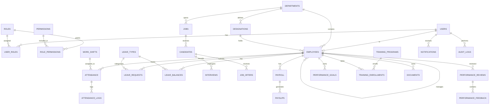

# 🗄️ Database Schema

All tables use `id BIGINT UNSIGNED AUTO_INCREMENT PRIMARY KEY`, `created_at`, `updated_at` timestamps, and `deleted_at` (soft delete) where noted. InnoDB engine throughout for FK support.

## Identity & Access

```
users              — email, password_hash, is_active, last_login, deleted_at
roles              — name (super_admin | hr_admin | manager | employee), description
permissions        — code (e.g. "employee.view_all"), description
user_roles         — user_id FK, role_id FK
role_permissions   — role_id FK, permission_id FK
```

## Core HR

```
departments        — name, description, deleted_at
designations        — title, department_id FK
employees          — user_id FK, employee_code, name fields, department_id FK,
                      designation_id FK, manager_id FK (self-referential),
                      joining_date, employment_type, employment_status, deleted_at
organization_settings — key/value config, updated_by FK
```

## Attendance

```
work_shifts        — name, start_time, end_time, grace_minutes
holidays           — name, date, is_optional
attendance         — employee_id FK, date, status, check_in/out, shift_id FK
                      UNIQUE(employee_id, date)
attendance_logs    — attendance_id FK, event_type, event_time, source, ip_address
```

## Leave

```
leave_types        — name, default_annual_days, is_paid
leave_balances     — employee_id FK, leave_type_id FK, year, allocated/used/carried_over days
leave_requests     — employee_id FK, leave_type_id FK, dates, status, reviewed_by FK
```

## Recruitment

```
jobs               — title, department_id FK, description, status, created_by FK
candidates         — job_id FK, contact info, resume_url, status
interviews         — candidate_id FK, interviewer_id FK, round_name, feedback, outcome
job_offers         — candidate_id FK, offered_salary, status, joining_date
```

## Payroll

```
payroll            — employee_id FK, period_month/year, base_salary, deductions,
                      net_salary, status, processed_by FK
                      UNIQUE(employee_id, period_month, period_year)
payslips           — payroll_id FK, file_url, generated_at
```

## Performance

```
performance_reviews   — employee_id FK, reviewer_id FK, period, scores, status
performance_goals     — employee_id FK, created_by FK, title, target_date, status, weight
performance_feedback  — review_id FK, given_by FK, comment
```

## Training

```
training_programs      — title, description, category, duration_hours
training_enrollments   — training_program_id FK, employee_id FK, status, progress_percent
                          UNIQUE(training_program_id, employee_id)
```

## Documents, Notifications, Audit

```
documents        — employee_id FK, category, file_url, uploaded_by FK, is_confidential
notifications    — user_id FK, category, title, message, is_read
audit_logs       — user_id FK (nullable), action, target_entity, target_id,
                    previous_value JSON, new_value JSON, ip_address
```

## Indexing & Constraints

- Indexes on all FK columns; composite indexes on `(employee_id, date)` for attendance, `(employee_id, period_month, period_year)` for payroll.
- Soft delete (`deleted_at`) on entities that must remain referenceable in historical records (employees, departments, documents, training programs, jobs) rather than hard-deleted, to preserve audit/report integrity.
- Cascading: attendance/leave/documents **cascade-delete-restrict** on employee soft-delete (blocked, not cascaded) to avoid silently destroying HR history.

## Entity-Relationship Diagram



⬅️ [Back to root README](../README.md)
